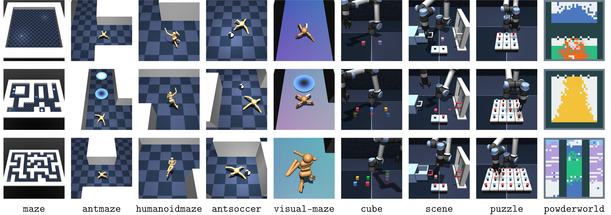

<div align="center">


<div id="user-content-toc">
  <ul align="center" style="list-style: none;">
    <summary>
      <h1>OGBench: Benchmarking Offline Goal-Conditioned RL</h1>
    </summary>
  </ul>
</div>

<a href="https://www.python.org/"></a> &emsp;
<a href="https://pypi.org/project/ogbench/"></a> &emsp;
<a href="https://docs.astral.sh/ruff/"></a> &emsp;
<a href="https://github.com/seohongpark/ogbench/blob/master/LICENSE"></a>




<div id="toc">
  <ul align="center" style="list-style: none;">
    <summary>
      <h2><a href="https://seohong.me/projects/ogbench/">Paper</a> &emsp; <a href="https://seohong.me/projects/ogbench/">Project page</a></h2>
    </summary>
  </ul>
</div>


</div>

# Overview

OGBench is a benchmark designed to facilitate algorithms research in offline goal-conditioned reinforcement learning (RL),
offline unsupervised RL, and offline RL.
See the [project page](https://seohong.me/projects/ogbench/) for videos and more details about the environments, tasks, and datasets.

### Features

- **8 types** of cool, realistic, diverse environments ([videos](https://seohong.me/projects/ogbench/)):
  - **Locomotion**: PointMaze, AntMaze, HumanoidMaze, and AntSoccer.
  - **Manipulation**: Cube, Scene, and Puzzle.
  - **Drawing**: Powderworld.
- **85 datasets** covering various challenges in offline goal-conditioned RL.
- Support for both **pixel-based** and **state-based** observations.
- **Clean, well-tuned reference implementations** of 6 offline goal-conditioned RL algorithms
(GCBC, GCIVL, GCIQL, QRL, CRL, and HIQL) based on Jax.
- **Fully reproducible** scripts for [the entire benchmark table](impls/hyperparameters.sh)
and [datasets](data_gen_scripts/commands.sh).
- `pip`-installable, easy-to-use APIs based on Gymnasium.
- No major dependencies other than MuJoCo.


# How to use the OGBench environments

### Installation

OGBench can be easily installed via PyPI:

```shell
pip install ogbench
```

It requires Python 3.8+ and has only three dependencies: `mujoco >= 3.1.6`, `dm_control >= 1.0.20`,
and `gymnasium`.

### Quick start

After installing OGBench, you can create an environment and datasets using `ogbench.make_env_and_datasets`.
The environment follows the [Gymnasium](https://gymnasium.farama.org/) interface.
The datasets will be automatically downloaded during the first run.

Here is an example of how to use OGBench:

```python
import ogbench

# Make an environment and datasets (they will be automatically downloaded).
dataset_name = 'antmaze-large-navigate-v0'
env, train_dataset, val_dataset = ogbench.make_env_and_datasets(dataset_name)

# Train your offline goal-conditioned RL agent on the dataset.
# ...

# Evaluate the agent.
for task_id in [1, 2, 3, 4, 5]:
    # Reset the environment and set the evaluation task.
    ob, info = env.reset(
        options=dict(
            task_id=task_id,  # Set the evaluation task. Each environment provides five
                              # evaluation goals, and `task_id` must be in [1, 5].
            render_goal=True,  # Set to `True` to get a rendered goal image (optional).
        )
    )

    goal = info['goal']  # Get the goal observation to pass to the agent.
    goal_rendered = info['goal_rendered']  # Get the rendered goal image (optional).

    done = False
    while not done:
        action = env.action_space.sample()  # Replace this with your agent's action.
        ob, reward, terminated, truncated, info = env.step(action)  # Gymnasium-style step.
        # If the agent reaches the goal, `terminated` will be `True`. If the episode length
        # exceeds the maximum length without reaching the goal, `truncated` will be `True`.
        done = terminated or truncated
        frame = env.render()  # Render the current frame (optional).

    success = info['success']  # Whether the agent reached the goal (0 or 1).
                               # `terminated` also indicates this.
```

You can find a complete example of a training script for offline goal-conditioned RL in the `impls` directory.
See the next section for more details on the reference implementations.

### Dataset APIs

OGBench provides several APIs to download and load datasets.
The simplest way is to use `ogbench.make_env_and_datasets` as shown above,
which creates an environment and loads training and validation datasets.
The datasets will automatically be downloaded to the directory specified by `dataset_dir` during the first run
(default: `~/.ogbench/data`).
`ogbench.make_env_and_datasets` also provides the `compact_dataset` option,
which returns a dataset without the `next_observations` field (see below).
For example:
```python
import ogbench

# Make an environment and load datasets.
dataset_name = 'antmaze-large-navigate-v0'
env, train_dataset, val_dataset = ogbench.make_env_and_datasets(
    dataset_name,  # Dataset name.
    dataset_dir='~/.ogbench/data',  # Directory to save datasets (optional).
    compact_dataset=False,  # Whether to use a compact dataset (optional; see below).
)

# Assume each dataset trajectory has a length of 4, and (s0, a0, s1), (s1, a1, s2),
# (s2, a2, s3), (s3, a3, s4) are the transition tuples.
# If `compact_dataset` is `False`, the dataset will have the following structure:
#                       |<- traj 1 ->|  |<- traj 2 ->|  ...
# ----------------------------------------------------------
# 'observations'     : [s0, s1, s2, s3, s0, s1, s2, s3, ...]
# 'actions'          : [a0, a1, a2, a3, a0, a1, a2, a3, ...]
# 'next_observations': [s1, s2, s3, s4, s1, s2, s3, s4, ...]
# 'terminals'        : [ 0,  0,  0,  1,  0,  0,  0,  1, ...]

# If `compact_dataset` is `True`, the dataset will have the following structure, where the
# `next_observations` field is omitted. Instead, it includes a `valids` field indicating
# whether the next observation is valid:
#                       |<--- traj 1 --->|  |<--- traj 2 --->|  ...
# ------------------------------------------------------------------
# 'observations'     : [s0, s1, s2, s3, s4, s0, s1, s2, s3, s4, ...]
# 'actions'          : [a0, a1, a2, a3, a4, a0, a1, a2, a3, a4, ...]
# 'terminals'        : [ 0,  0,  0,  1,  1,  0,  0,  0,  1,  1, ...]
# 'valids'           : [ 1,  1,  1,  1,  0,  1,  1,  1,  1,  0, ...]
```

To download multiple datasets at once, you can use `ogbench.download_datasets`:
```python
import ogbench

dataset_names = [
    'humanoidmaze-medium-navigate-v0',
    'visual-puzzle-3x3-play-v0',
    'powderworld-easy-play-v0',
]
ogbench.download_datasets(
    dataset_names,  # List of dataset names.
    dataset_dir='~/.ogbench/data',  # Directory to save datasets (optional).
)
```


# How to use the reference implementations

OGBench also provides Jax-based reference implementations of six offline goal-conditioned RL algorithms
(GCBC, GCIVL, GCIQL, QRL, CRL and HIQL).
They are provided in the `impls` directory as a **standalone** codebase.
You can safely remove the other parts of the repository if you only need the reference implementations
and do not want to modify the environments.

### Installation

Our reference implementations require Python 3.9+ and additional dependencies, including `jax >= 0.4.26`.
To install these dependencies, run:

```shell
cd impls
pip install -r requirements.txt
```

By default, it uses the PyPI version of OGBench.
If you want to use a local version of OGBench (e.g., for training methods on modified environments),
run instead `pip install -e ".[train]"` in the root directory.

### Running the reference implementations

Each algorithm is implemented in a separate file in the `agents` directory.
We provide implementations of the following offline goal-conditioned RL algorithms:

- `gcbc.py`: Goal-Conditioned Behavioral Cloning (GCBC)
- `gcivl.py`: Goal-Conditioned Implicit V-Learning (GCIVL)
- `gciql.py`: Goal-Conditioned Implicit Q-Learning (GCIQL)
- `qrl.py`: Quasimetric Reinforcement Learning (QRL)
- `crl.py`: Contrastive Reinforcement Learning (CRL)
- `hiql.py`: Hierarchical Implicit Q-Learning (HIQL)

To train an agent, you can run the `main.py` script.
Training metrics, evaluation metrics, and videos are logged via `wandb` by default.
Here are some example commands (see [hyperparameters.sh](impls/hyperparameters.sh) for the full list of commands):

```shell
# antmaze-large-navigate-v0 (GCBC)
python main.py --env_name=antmaze-large-navigate-v0 --agent=agents/gcbc.py
# antmaze-large-navigate-v0 (GCIVL)
python main.py --env_name=antmaze-large-navigate-v0 --agent=agents/gcivl.py --agent.alpha=10.0
# antmaze-large-navigate-v0 (GCIQL)
python main.py --env_name=antmaze-large-navigate-v0 --agent=agents/gciql.py --agent.alpha=0.3
# antmaze-large-navigate-v0 (QRL)
python main.py --env_name=antmaze-large-navigate-v0 --agent=agents/qrl.py --agent.alpha=0.003
# antmaze-large-navigate-v0 (CRL)
python main.py --env_name=antmaze-large-navigate-v0 --agent=agents/crl.py --agent.alpha=0.1
# antmaze-large-navigate-v0 (HIQL)
python main.py --env_name=antmaze-large-navigate-v0 --agent=agents/hiql.py --agent.high_alpha=3.0 --agent.low_alpha=3.0
```

Each run typically takes 2-5 hours (on state-based tasks)
or 5-12 hours (on pixel-based tasks) on a single A5000 GPU.
For large pixel-based datasets (e.g., `visual-puzzle-4x6-play-v0` with 5M transitions),
up to 120GB of RAM may be required.

### Notes on hyperparameters and flags

To reproduce the results in the paper, you need to use the hyperparameters provided.
We provide a complete list of the exact command-line flags used to produce the main benchmark table
in the paper in [hyperparameters.sh](impls/hyperparameters.sh).
Below, we highlight some important hyperparameters and common pitfalls:

- Regardless of the algorithms, one of the most important hyperparameters is `agent.alpha` (i.e., the temperature (AWR) or the BC coefficient (DDPG+BC))
for the actor loss. It is crucial to tune this hyperparameter when running an algorithm on a new environment.
In the paper, we provide a separate table of the policy extraction hyperparameters,
which are individually tuned for each environment and dataset category.
- By default, actor goals are uniformly sampled from the future states in the same trajectory.
We found this works best in most cases, but you can adjust this to allow random actor goals
(e.g., by setting `--agent.actor_p_trajgoal=0.5 --agent.actor_p_randomgoal=0.5`).
This is especially important for datasets that require stitching.
See the hyperparameter table in the paper for the values used in benchmarking.
- For GCIQL, CRL, and QRL, we provide two policy extraction methods: AWR and DDPG+BC.
In general, DDPG+BC works better than AWR (see [this paper](https://arxiv.org/abs/2406.09329) for the reasons),
but DDPG+BC is usually more sensitive to the `alpha` hyperparameter than AWR.
As such, in a new environment, we recommend starting with AWR to get a sence of the performance
and then switching to DDPG+BC to further improve the performance.
- Our QRL implementation provides two quasimetric parameterizations: MRN and IQE.
We found that IQE (default) works better in general, but it is almost twice as slow as MRN.
- In CRL, we found that using `--agent.actor_log_q=True` (which is set by default) is important for strong performance, especially in locomotion environments.
We found this doesn't help much with other algorithms.
- In HIQL, setting `--agent.low_actor_rep_grad=True` (which is `False` by default) is crucial in pixel-based environments.
This allows gradients to flow from the low-level actor loss to the subgoal representation, which helps maintain better representations.
- In pixel-based environments, don't forget to set `agent.encoder`. We used `--agent.encoder=impala_small` across all pixel-based environments.
- In discrete-action environments (e.g., Powderworld), don't forget to set `--agent.discrete=True`.
- In Powderworld, use `--eval_temperature=0.3`, which helps prevent the agent from getting stuck in certain states.


# How to reproduce the datasets

We provide the full scripts and exact command-line flags used to produce all the datasets in OGBench.
The scripts are provided in the `data_gen_scripts` directory.

### Installation

Data-generation scripts for locomotion environments require Python 3.9+ and additional dependencies,
including `jax >= 0.4.26`, to train and load expert agents.
For manipulation and drawing environments, no additional dependencies are required.
To install the necessary dependencies for locomotion environments, run the following command in the root directory:
```shell
pip install -e ".[train]"
```

This installs the same dependencies as the reference implementations, but in the editable mode (`-e`).

### Reproducing the datasets

To reproduce the datasets, you can run the scripts in the `data_gen_scripts` directory.
For locomotion environments, you need to first download the expert policies.
We provide the exact command-line flags used to produce the datasets in [commands.sh](data_gen_scripts/commands.sh).
Here is an example of how to reproduce a dataset for the `antmaze-large-navigate-v0` task:

```shell
cd data_gen_scripts
# Download the expert policies for locomotion environments (not required for other environments).
wget https://rail.eecs.berkeley.edu/datasets/ogbench/experts.tar.gz
tar xf experts.tar.gz && rm experts.tar.gz
# Create a directory to save datasets.
mkdir -p data
# Add the `impls` directory to PYTHONPATH.
# Alternatively, you can move the contents of `data_gen_scripts` to `impls` instead of setting PYTHONPATH.
export PYTHONPATH="../impls:${PYTHONPATH}"  
# Generate a dataset for `antmaze-large-navigate-v0`.
python generate_locomaze.py --env_name=antmaze-large-v0 --save_path=data/antmaze-large-navigate-v0.npz
```

### Reproducing the expert policies

If you want to train your own expert policies from scratch, you can run the corresponding commands in [commands.sh](data_gen_scripts/commands.sh).
For example, to train an Ant expert policy, you can run the following command in the `data_gen_scripts` directory after setting `PYTHONPATH` as above:
```shell
python main_sac.py --env_name=online-ant-xy-v0
```

# Questions?

If you have any questions or issues, feel free to open an issue on this repository.
You can also reach out via email to [Seohong Park](https://seohong.me) at [seohong@berkeley.edu](mailto:seohong@berkeley.edu).

# Acknowledgments

This codebase is inspired by or partly uses code from the following repositories:
- [D4RL](https://github.com/Farama-Foundation/D4RL) for the dataset structure and the AntMaze environment.
- [Gymnasium](https://github.com/Farama-Foundation/Gymnasium) and [dm_control](https://github.com/google-deepmind/dm_control) for the agents (Ant and Humanoid) in the locomotion environments.
- [MuJoCo Menagerie](https://github.com/google-deepmind/mujoco_menagerie) for the robot descriptions (Universal Robots UR5e and Robotiq 2F-85) in the manipulation environments.
- [jaxlie](https://github.com/brentyi/jaxlie) for Lie group operations in the manipulation environments.
- [Meta-World](https://github.com/Farama-Foundation/Metaworld) for the objects (drawer, window, and button) in the manipulation environments.
- [Powderworld](https://github.com/kvfrans/powderworld) for the Powderworld environment.
- [NumPyConv2D](https://github.com/99991/NumPyConv2D) for the NumPy Conv2D implementation in the Powderworld environment.
- [jaxrl_m](https://github.com/dibyaghosh/jaxrl_m), [rlbase](https://github.com/kvfrans/rlbase_stable),
  [HIQL](https://github.com/seohongpark/HIQL), and [cmd-notebook](https://github.com/vivekmyers/cmd-notebook)
  for Jax-based implementations of RL algorithms.

Special thanks to [Kevin Zakka](https://kzakka.com/) for providing the initial codebase for the manipulation environments.

# Citation

```bibtex
@article{ogbench_park2024,
  title={OGBench: Benchmarking Offline Goal-Conditioned RL},
  author={Seohong Park and Kevin Frans and Benjamin Eysenbach and Sergey Levine},
  journal={ArXiv},
  year={2024}
}
```
